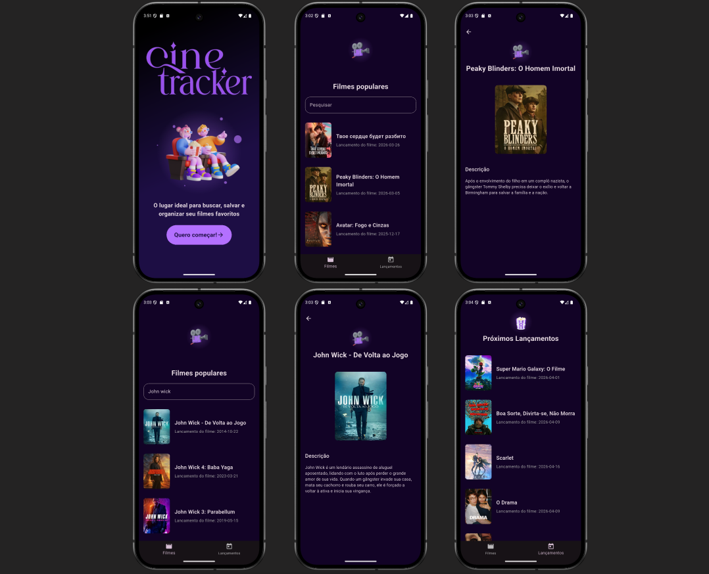
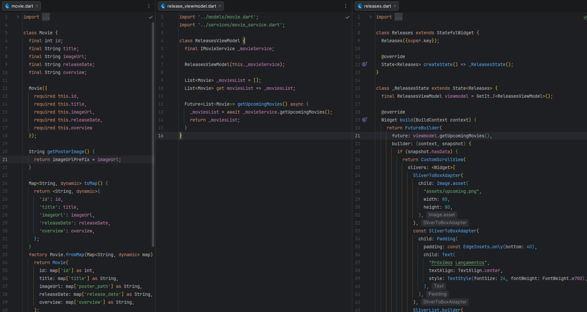
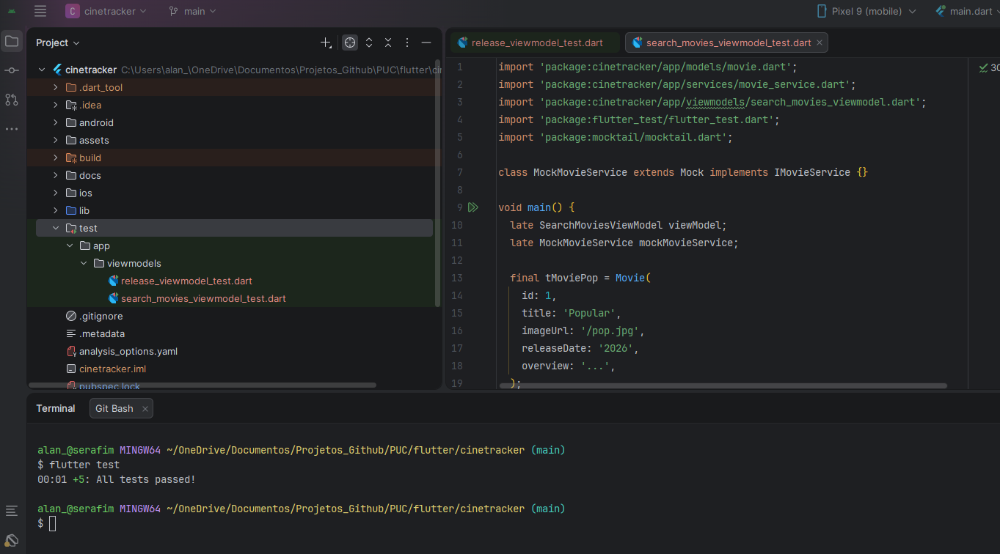

# Aplicativo `cinetracker` - Seu descobridor de filmes

## Projeto da disciplina

### Curso:
* Pós Graduação em Desenvolvimento de aplicativos móveis - PUCPR

### Disciplinas:
* Desenvolvimento Mobile Professional

### Imagens do Projeto

<br>

## Ferramentas
As seguintes ferramentas foram usadas na construção do projeto:

### 👉 **_Mobile_**

- Flutter
- Dart
- API do The Movie Database (TMDB)
- Mocktail
- Get It

### 👉 **_Desenvolvimento Geral_**

- Editor:
    - Android Studio
- Prototipagem:
    - Figma
- Reuniões:
    - Teams
- Diagramas:
    - Draw.io

## Introdução

Este projeto possui o objetivo principal **implementar um aplicativo descobridor de filmes**.


## Análise técnica

### Requisitos Funcionais

* **RF01** - Busca: O usuário deve buscar por títulos, e o app deve retornar filmes usando o endpoint TMDb.
* **RF02** - Detalhes Específicos: O app deve exibir detalhes pertinentes como a descrição do filme.
* **RF03** - Exibição de novidades e lançamentos: O app deve exibir filme recentes e lançamentos em tela dedicada.
### Fluxo de Navegação

Utilizaremos a estrutura clássica de abas (Tab Bar):

* **Tab 1 (Filmes)**: Barra de busca e lista de filmes populares (TMDb).
* **Tab 2 (Lançamentos)**: Lista de filmes lançados recentemente.
* **View de Detalhes**: Tela comum acessada por qualquer uma das abas acima, mostrando os dados complementares do filme.

### Descrição do ambiente técnico

O sistema é composto por um app desenvolvido em Flutter e disponibilizado para Android e IOS.
As informações dos filmes e séries são fornecidadas através da integração com a API do The Movie Database (TMDB).

### Diagrama de Classes de Domínio

A ideia do diagrama de classes de domínio é fornecer um documentação enxuta que será utilizada como ponto de partida para o desenvolvimento do projeto, sem a preocupação com os demais detalhes da UML.

    <br>

## Evidências avaliativas

### Clean Code
    Seguir as diretrizes básicas de código limpo para garantir legibilidade e manutenção.
### Padrão Arquitetural - MVVM

O padrão arquitetural adotado foi o modelo View-Model-ViewModel (MVVM).

```txt
lib/
├── app/
│   ├── di/                 # Injeção de Dependência
│   ├── helpers/            # Classes auxiliares
│   ├── models/             # Classes de dados 
│   ├── services/           # Classes que realizam chamadas para API
│   └── viewmodels/         # Classes que realizam a lógica de negócio
├── ui/
│   ├── views/              # As telas da aplicação
│   └── widgets/            # Os componentes reutilizáveis
└── main.dart

```


<br>


    
### Injeção de Dependência
    Implementar o uso de Dependency Injection para promover um código mais modular e testável.
### Testes unitários
Para garantir a qualidade e funcionalidade do código foi realizado testes unitários com o framework Flutter Test e o framework Mocktail para simular chamadas da API.


<br>

### Design Patterns
    Utilizar padrões de design apropriados para resolver problemas comuns de desenvolvimento
### Interface
    3 telas funcionais: ok

O modelo de prototipação escolhido foi o mockup de alta fidelidade com as principais telas da aplicação.

    

### Links do Projeto

* [TMDB API](https://developer.themoviedb.org/reference/getting-started)
* [Stitch AI Design](https://stitch.withgoogle.com/)
* [Google AI Studio](https://aistudio.google.com/)

## Conceitos básicos

##### Processo de Desenvolvimento de Software - PDS

> O PDS segue a metodologia ágil sendo um abordagem interativa incremental.

### 👨‍💻 Responsável

<table border="0" align="left">
  <tr>
    <td align="center">
      <br>
      <sub>
        <a href="https://github.com/alanserafim"> Alan </a>
      </sub>
    </td>
  </tr>
</table>

